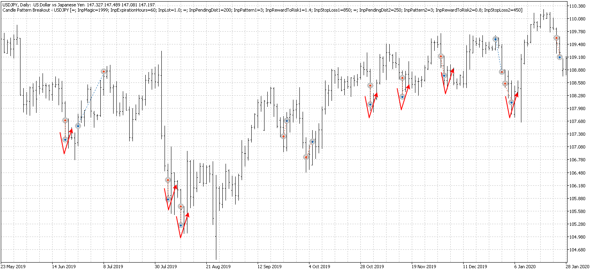
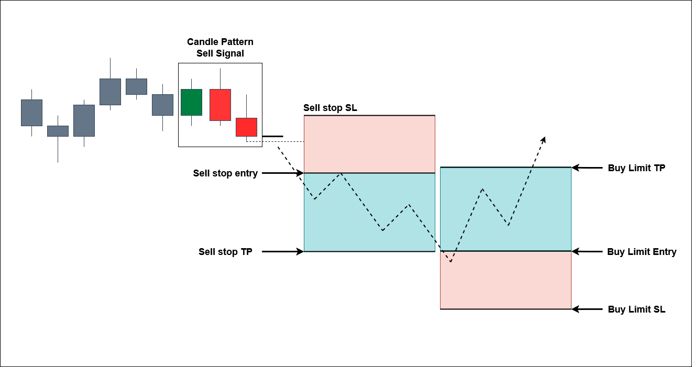

# Improvement to an Existing Strategy
--- Part 5 ---

---
This part will discuss an improvement to the trading strategy development in the previous part (part 4). I am actually using this improvement in my real trading account.

## Disclaimer !!!

**I do not recommend that anybody follow my strategy, as I cannot guarantee this strategy will continue to deliver positive results in the future**. **Alpha-decay** (a decay of an algorithmic trading performance) is a real phenomenon, and you should know about it.

I ran the strategy across several forex pairs and indices, and each market has its own setting tailored to its market characteristics. You cannot only rely on one pair/market and hope it will constantly print money. Each market has its own period of several consecutive losses, even though in the long run it still delivers positive results. By deploying the strategy on several markets, any consecutive loss period would be covered by profits from other markets.

One more thing, all of the strategy codes presented in this article are the simplified versions of what I am using right now. The simplifications are made to ease the understanding of the underlying logic behind the strategy. You cannot just use the code presented here to trade on a real account. These codes are enough to conduct a backtest and optimization, but still need many additional codes to be run on a real account.

---

## Background
During the development process of the previous trading strategy on the USDJPY pair for the Daily timeframe, I noticed something interesting. There are many cases of the sell stop order is triggered, the price falls straight to the take profit level, and then it rebounds up to the entry level or even beyond. This got me thinking, "**_hmmmm... What if I put a buy limit order somewhere near the take profit level?_**". Interesting right? The picture below should give you the idea straight away. Yes, of course, it will not work 100% of the time. But will it improve the overall performance?



## Basic Setup
As the improvement discussed in this section is an additional buy limit posted after a sell signal is detected, we have to wait for a sell signal to appear first. The buy limit signal will have some dependencies on the sell signal. If we observe the picture above and the general idea behind it, it is mandatory to set the buy limit level at or near the TP level of the sell stop. This will result in the "price rebound" after the sell stop TP is triggered, then trigger the buy limit order. In other words, the buy limit order distance needs to be set as a sell-stop pending distance plus the sell-stop TP distance.

**_Buy Limit Distance = Sell Stop Pending Distance + Sell Stop TP Distance_**

This is an initial value which will then be optimized.

**_Buy Limit TP Distance = Sell Stop TP Distance + some adjustments_**

These two values are the main criteria for our buy limit order. The picture below will give a clearer description.



## MQL5 Code
As per the previous section, I code the strategy into a class, which is then called by the trading strategy code. With this approach, any additional improvements and features will be modular and will not interfere with our other strategies. 

### Trading Strategy Logic - Code Snippet
The code snippet below is very similar to the previous section, but for the sell signal, instead of returning yesterday's low, it now returns yesterday's high, and vice versa. There are some "reversion" to the calculation of the TP and SL at the executeBuy/Sell function as expected, but that's it basically!!

```mql5
```
