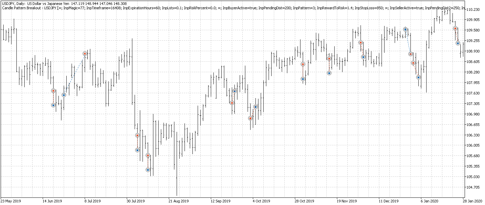
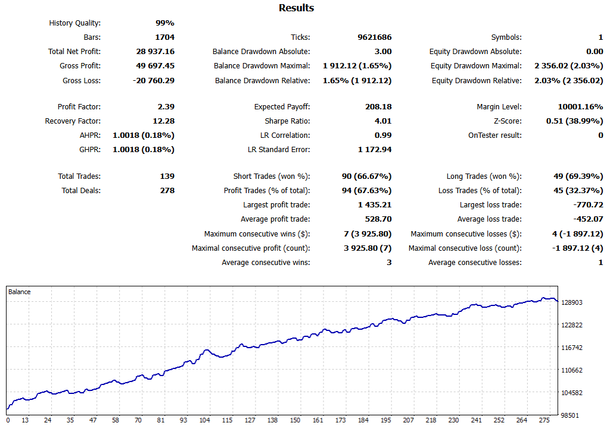
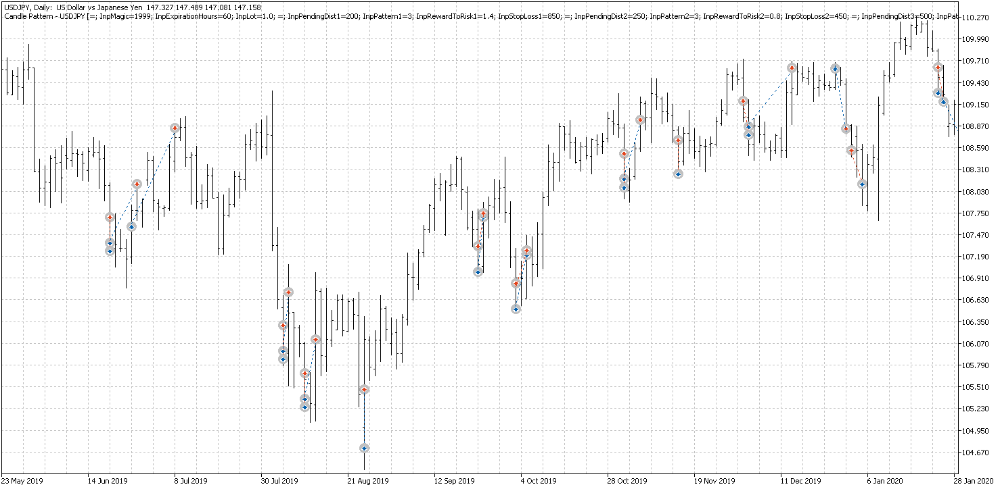
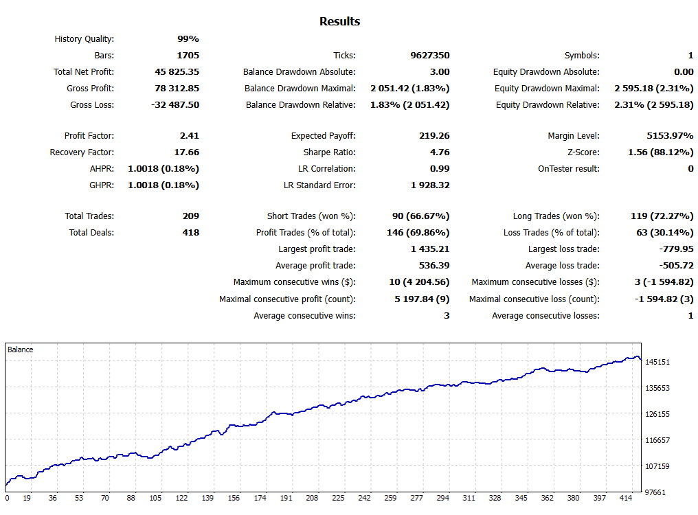

# Improvement to an Existing Strategy
--- Part 5 ---

Previous Section (part 1): [Basic Understanding of Markov Chain in Financial Market](https://github.com/handiko/Markov-Chain-In-Financial-Market/blob/main/README.md)

Previous Section (part 2): [Using Markov chain to analyze first insight of a forex pair, index, or any market](https://github.com/handiko/Markov-Chain-UpDown-Day/blob/main/README.md)

Previous Section (part 3): [Using a Markov chain to determine market risk](https://github.com/handiko/Markov-Chain-In-Financial-Market-Risk/blob/main/README.md)

Previous Section (part 4): [Trading Strategy Development Example](https://github.com/handiko/Trading-Strategy-Development-Example/blob/main/README.md)

---
Building on the strategy from Part 4, this section discusses a key improvement that I have personally implemented in my live trading.

## Disclaimer !!!
**You shouldn't follow this strategy, as I can't guarantee its future performance**. The phenomenon of **_alpha decay_**—the natural decline in a trading algorithm's effectiveness over time—is a well-documented reality that you should be aware of.

**I ran the strategy across several forex pairs and indices, and each market has its own setting tailored to its market characteristics**. You cannot only rely on one pair/market and hope it will constantly print money. Each market has its own period of several consecutive losses, even though in the long run it still delivers positive results. By deploying the strategy on several markets, any consecutive loss period would be covered by profits from other markets.

I have simplified the strategy code in this article to make the underlying logic easier to understand. These code snippets are suitable for backtesting and optimization but require additional programming before they can be deployed in a live trading environment.

---

## Background
When developing the previous trading strategy for the USDJPY daily timeframe, I observed a frequent pattern: a triggered sell stop order would hit its take-profit (TP) level and immediately rebound back to, or even beyond, the original entry price. This led me to a key hypothesis: **_"What if I place a buy limit order near the sell stop's take-profit level?"_** This approach aims to capitalize on the expected price bounce. While not always successful, the question is whether this additional trade can enhance the strategy's overall performance. The image below illustrates this concept clearly.


## Basic Setup
This improvement involves placing an additional buy limit order after a sell signal is detected. The buy limit signal is therefore dependent on the initial sell signal. As shown in the image above, the buy limit order must be set at or near the take-profit (TP) level of the sell-stop order. This strategy is based on the expectation of a price rebound after the sell-stop's TP is triggered, which would then activate the buy limit order. Consequently, the distance of the buy limit order should be the sum of the sell-stop's pending distance and its TP distance.

**_Buy Limit Distance = Sell Stop Pending Distance + Sell Stop TP Distance_**

This is an initial value which will then be optimized.

**_Buy Limit TP Distance = Sell Stop TP Distance + some adjustments_**

These two values are the main criteria for our buy limit order. The picture below will give a clearer description.


## MQL5 Code
By coding the strategy into a class and calling it from the main trading strategy, we've adopted an object-oriented approach. This design ensures that all future improvements and features are modular, preventing any interference with our existing strategies.

### Trading Strategy Logic - Code Snippet
The code snippet below is similar to the previous section. However, for the buy signal, the logic has been reversed: it now returns yesterday's low instead of the high, and vice versa for the sell signal. The executeBuy/Sell functions also include the expected reversion in the Take-Profit (TP) and Stop-Loss (SL) calculations. I've only included the code for the buy signal as an example; the full code is available in the [MQL5 folder](https://github.com/handiko/Improvement-to-an-existing-strategy/tree/main/MQL5).

[CandlePatternReversal.mqh](https://github.com/handiko/Improvement-to-an-existing-strategy/blob/main/MQL5/CandlePatternReversal.mqh) :
```mql5
//+------------------------------------------------------------------+
//|                                                                  |
//+------------------------------------------------------------------+
double CandlePatternReversal::findBuySignal() {
     ENUM_CANDLE_PATTERN cp;
     double low;
     bool candle[3];

     for(int i = 0; i < 3; i++) {
          candle[i] = (iClose(Pair, Timeframe, i + 1) > iOpen(Pair, Timeframe, i + 1)) ? true : false;
     }

     if(candle[2] && candle[1] && candle[0]) {
          cp = UUU;
     } else if(candle[2] && candle[1] && !candle[0]) {
          cp = UUD;
     } else if(candle[2] && !candle[1] && candle[0]) {
          cp = UDU;
     } else if(candle[2] && !candle[1] && !candle[0]) {
          cp = UDD;
     } else if(!candle[2] && candle[1] && candle[0]) {
          cp = DUU;
     } else if(!candle[2] && candle[1] && !candle[0]) {
          cp = DUD;
     } else if(!candle[2] && !candle[1] && candle[0]) {
          cp = DDU;
     } else {
          cp = DDD;
     }

     low = iLow(Pair, Timeframe, 1);
     if(cp == Pattern) {
          return low;
     }

     return -1;
}

//+------------------------------------------------------------------+
//|                                                                  |
//+------------------------------------------------------------------+
void CandlePatternReversal::executeBuy(double entry) {
     entry = NormalizeDouble(entry - LiquidityDist * pairPoint, pairDigits);

     double ask = SymbolInfoDouble(Pair, SYMBOL_ASK);
     if(ask < entry) return;

     double tp = entry + TakeProfit * pairPoint;
     tp = NormalizeDouble(tp, pairDigits);

     double sl = entry - StopLoss * pairPoint;
     sl = NormalizeDouble(sl, pairDigits);

     double lots = Lots;

     datetime expiration = iTime(Pair, Timeframe, 0) + ExpirationHours * PeriodSeconds(PERIOD_H1) - PeriodSeconds(PERIOD_M5);

     trade.BuyLimit(lots, entry, Pair, sl, tp, ORDER_TIME_SPECIFIED, expiration);

     buyPos = trade.ResultOrder();
}
```


The Full Code of the new USDJPY Candle Pattern trading strategy is now like this:

```mql5
//+------------------------------------------------------------------+
//|                                      Candle Pattern - USDJPY.mq5 |
//|                                   Copyright 2025, Handiko Gesang |
//|                                   https://www.github.com/handiko |
//+------------------------------------------------------------------+
#property copyright "Copyright 2025, Handiko Gesang"
#property link      "https://www.github.com/handiko"
#property version   "1.00"

#include "CandlePatternBreakout.mqh"
#include "CandlePatternReversal.mqh"

input group "General Settings"
static input int InpMagic = 1999;                     // Magic Number
input int InpExpirationHours = 60;                    // Expiration Hours
input double InpLot = 1.0;                            // Lot (fixed)

input group "Buy Breakout Settings"
input int InpPendingDist1 = 200;                      // Liquidity Distance (points)
input ENUM_CANDLE_PATTERN InpPattern1 = UDD;          // Candle Pattern
input double InpRewardToRisk1 = 1.4;                  // Reward to Risk Ratio
input int InpStopLoss1 = 850;                         // StopLoss (points)

input group "Sell Breakout Settings"
input int InpPendingDist2 = 250;                      // Liquidity Distance (points)
input ENUM_CANDLE_PATTERN InpPattern2 = UDD;          // Candle Pattern
input double InpRewardToRisk2 = 0.8;                  // Reward to Risk Ratio
input int InpStopLoss2 = 450;                         // StopLoss (points)

input group "Buy Limit Settings"
input int InpPendingDist3 = 500;                      // Liquidity Distance (points)
input ENUM_CANDLE_PATTERN InpPattern3 = UDD;          // Candle Pattern
input double InpRewardToRisk3 = 0.8;                  // Reward to Risk Ratio
input int InpStopLoss3 = 850;                         // StopLoss (points)

//+------------------------------------------------------------------+
//|                                                                  |
//+------------------------------------------------------------------+
CandlePatternBreakout buystop("USDJPY", InpLot, InpPendingDist1, InpPattern1, InpRewardToRisk1,
                              InpStopLoss1, PERIOD_D1, InpExpirationHours, InpMagic + 1, BUY_ONLY);

//+------------------------------------------------------------------+
//|                                                                  |
//+------------------------------------------------------------------+
CandlePatternBreakout sellstop("USDJPY", InpLot, InpPendingDist2, InpPattern2, InpRewardToRisk2,
                               InpStopLoss2, PERIOD_D1, InpExpirationHours, InpMagic + 2, SELL_ONLY);

//+------------------------------------------------------------------+
//|                                                                  |
//+------------------------------------------------------------------+
CandlePatternReversal buyLimit("USDJPY", InpLot, InpPendingDist3, InpPattern3, InpRewardToRisk3,
                               InpStopLoss3, PERIOD_D1, InpExpirationHours, InpMagic + 3, BUY_ONLY);

//+------------------------------------------------------------------+
//| Expert initialization function                                   |
//+------------------------------------------------------------------+
int OnInit() {
     buystop.OnInitEvent();
     sellstop.OnInitEvent();
     buyLimit.OnInitEvent();

     return(INIT_SUCCEEDED);
}

//+------------------------------------------------------------------+
//| Expert deinitialization function                                 |
//+------------------------------------------------------------------+
void OnDeinit(const int reason) {
     buystop.OnDeinitEvent(reason);
     sellstop.OnDeinitEvent(reason);
     buyLimit.OnDeinitEvent(reason);
}

//+------------------------------------------------------------------+
//| Expert tick function                                             |
//+------------------------------------------------------------------+
void OnTick() {
     buystop.OnTickEvent();
     sellstop.OnTickEvent();
     buyLimit.OnTickEvent();
}
//+------------------------------------------------------------------+

```
The code's parameters have been optimized according to the rules in the previous section.

## The Results
The image below illustrates how the improvement generates new trading entries. These entries are created simultaneously with the sell stop order and are designed to cover sell stop trades that reverse back to SL before hitting their take-profit target.

### Before




### After




## Conclusions
This revised trading strategy offers a significant improvement. By analyzing the unique characteristics of each strategy, we can leverage these insights to create a new feature that boosts performance. The results above demonstrate that this additional feature has significantly enhanced the overall performance of the strategy.

---

MQL5 Codes included in this article:
1. [Candle Pattern - USDJPY.mq5](https://github.com/handiko/Improvement-to-an-existing-strategy/blob/main/MQL5/Candle%20Pattern%20-%20USDJPY.mq5)
2. [CandlePatternReversal.mqh - Strategy Class](https://github.com/handiko/Improvement-to-an-existing-strategy/blob/main/MQL5/CandlePatternReversal.mqh)
3. [CandlePatternBreakout.mqh - Strategy Class](https://github.com/handiko/Improvement-to-an-existing-strategy/blob/main/MQL5/CandlePatternBreakout.mqh)
4. [main.mqh - basic library](https://github.com/handiko/Improvement-to-an-existing-strategy/blob/main/MQL5/main.mqh)
5. [StandardIncludes.mqh - other functions](https://github.com/handiko/Improvement-to-an-existing-strategy/blob/main/MQL5/StandardIncludes.mqh)

---

Back to [Index](https://github.com/handiko/handiko/blob/master/README.md)
